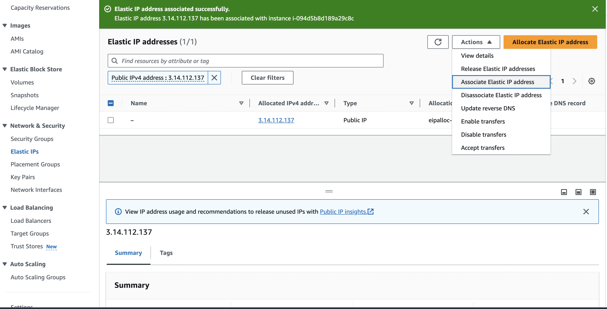

# 01-Intro
[What is MLOps](https://www.databricks.com/glossary/mlops)?

MLOps stands for Machine Learning Operations. MLOps is a core function of Machine Learning engineering, focused on streamlining the process of taking machine learning models to production, and then maintaining and monitoring them.

## 1.1 - Introduction

## 1.2.1 Configuring Environment with GitHub Codespaces (new in 2024)
Use [GitHub Codespaces](https://www.youtube.com/watch?v=MzcmWXYxi2s&list=PL3MmuxUbc_hIUISrluw_A7wDSmfOhErJK&index=2) to prepare the environment.

1. Create GitHub Codespaces on Github, and open in VScode.
2. Download and install the Anaconda distribution of Python
3. Update existing packages
4. Install Docker and Docker Compose
Follow the instructions here
5. Run Docker

## 1.2.2 Environment preparation on GitHub Codespaces

### Prepare AWS environment:
1. Create/Log in AWS
2. Create an EC2 instance (create a key pairs if it is new one)
3. Launch the EC2 instance.

After launch the EC2 instance, we aim to connect the EC2 instance and develop on it.

### Connect EC2 instance
Connect EC2 instance from code spaces on VScode by `ssh -i ~/.ssh/YOUR-KEY-PAIR.pem ubuntu@IPV4-ADDRESS`

To connect to your EC2 instance from GitHub Codespaces on VSCode using the shortened command `ssh mlops-zoomcamp`, you can configure your SSH settings in the `~/.ssh/config` file. Here’s how to do it:

1. **Open the SSH Config File**:
   Open the SSH configuration file using Vim or any other text editor.

   ```bash
   vim ~/.ssh/config
   ```

2. **Edit the Config File**:
   Add the following configuration block to the file. Replace /home/codespace/.ssh/YOUR-KEY-PAIR.pem with the path to your actual private key file and IPV4-ADDRESS with the IP address of your EC2 instance.
   Copy paste your key file from local machine to the codespaces if required. It might require the correct permissions with `chmod 600 /home/codespace/.ssh/YOUR-KEY-PAIR.pem`

    ```
    Host mlops-zoomcamp
            HostName 3.14.112.137
            User ubuntu
            IdentityFile /home/codespace/.ssh/mlopszoomcamp.pem
            StrictHostKeyChecking no                           
    ```

- Host: This specifies the alias for the host. 

- HostName: IPv4 of EC2 instance

- User: This specifies the username to use when connecting to the server.

- IdentityFile: This specifies the path to the SSH private key file to use for authentication.

- StrictHostKeyChecking: This option controls whether SSH will automatically add new host keys to the known_hosts file and will check for host key changes. Setting it to no means that SSH will not ask for confirmation before connecting to a host for the first time and will automatically add the host key to the known_hosts file. 

3. **Connect to the EC2 Instance**:
   Now, you can connect to your EC2 instance using the simplified command:

   ```bash
   ssh mlops-zoomcamp
   ```

Here is a complete example:

### Complete Example:

1. Copy paste your keypair to codespaces and make sure the permission is correct.

   ```bash
   chmod 600 /home/codespace/.ssh/mlopszoomcamp.pem
   ```

2. Open the SSH configuration file:

   ```bash
   vim ~/.ssh/config
   ```

3. Add the following configuration:

   ```plaintext
   Host mlops-zoomcamp
       HostName 3.14.112.137          # Replace with your EC2 instance's IP address
       User ubuntu
       IdentityFile /home/codespace/.ssh/mlopszoomcamp.pem  # Replace with the path to your private key
       StrictHostKeyChecking no
   ```

4. Connect using the simplified command:

   ```bash
   ssh mlops-zoomcamp
   ```

By following these steps, you can connect to your EC2 instance more conveniently without typing the full command each time.

**Note: How to make the IPv4 be static**

Since IPv4 is changed each time when restart the instance, keep the HostName updated in the config file; or set Elastic IP to make sure it is static.

On the left menu of EC2 page, `Network & Security - Elastic IPs - Allocate Elastic IPs` to create a static IP address. And then `Actions - Associate Elastic IP address` to the corresponding EC2 instance.




## 1.3 Reading Parquet files instead of csv
## 1.3.2 Training a ride duration prediction model
## 1.4 Course overview
## 1.5 MLops maturity model

