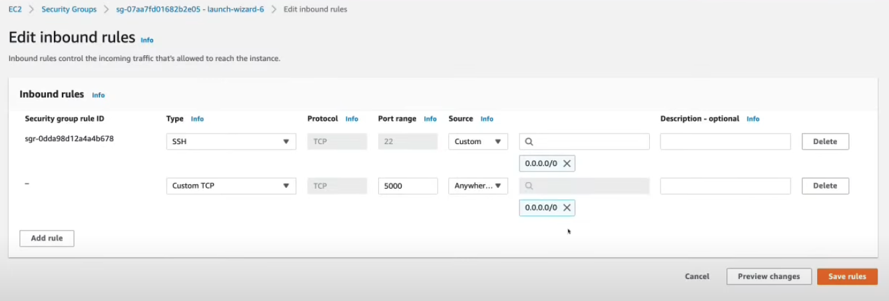
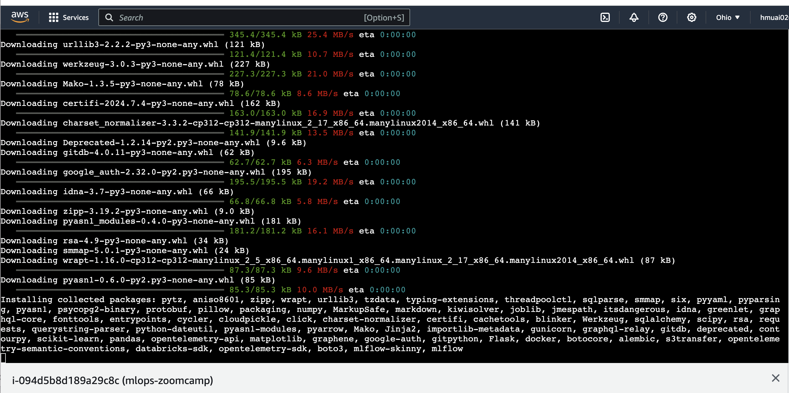
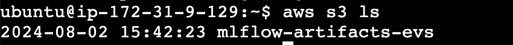

# 02-Experiment-tracking
By tracking the development of the target model, MLflow encapsulates a specific target which can house multiple runs. Runs document critical data like metrics, parameters, and the code state, which are convenient for developers/scientist to track the record when developing the ML model.

In this tutorial, we will mainly focus on model tracking and model registry.

## 2.1 - Experiment tracking intro
### What is Experiment Tracking?
    Experiment tracking refers to the process of recording and organizing various details about machine learning experiments. This includes tracking parameters, code versions, data sets, models, and results (metrics and artifacts) to facilitate reproducibility, comparison, and collaboration.

    MLflow tracking module allows us to organize our experiments into runs, and keeps track of:
        - parameters
        - metrics
        - metadata
        - artifact
        - models

        Along with the above info, MLflow automatically logs extra information about the run:
        - Source code
        - Version of the code
        - Start and end time
        - Author


### Why Do We Need Experiment Tracking?

1. **Reproducibility**: Ensures that experiments can be reproduced by recording all relevant details.
2. **Comparison**: Facilitates comparing different experiments to identify the best-performing models.
3. **Collaboration**: Allows teams to share experiments and results easily.
4. **Organizational Efficiency**: Helps manage the myriad of experiments and versions typically generated in machine learning projects.
5. **Debugging**: Simplifies identifying where changes in parameters or data lead to improvements or regressions in model performance.
6. **Regulatory Compliance**: Necessary in regulated industries to provide an audit trail of model development.


### How to Track Experiments with MLflow
See from MLflow in practice

## Use MLflow to track the model when developing
1. Create an experiment on MLflow for tracking the model
- Experiment Name
- Artifact Location

2. Prepare the local env

- Create a `conda` env
- Activate the Conda env and install dependency with `pip` 
3. Lunch MLflow

    `mlflow ui --backend-store-uri sqlite:///mlflow.db` in terminal.

4. Set the config of MLflow
    ```
    import mlflow
    mlflow.set_tracking_uri("sqlite:///mlflow.db)
    mlflow.set_experiment("Experiment_Name")
    with mlflow.start_run():
        mlflow.set_tag()
        mlflow.log_param()
        mlflow.log_metric()
    ```
5. Experiment tracking with MLflow

- Add params tuning to tune the model in notebook
- Show how it works in MLflow
- Best params
- Autolog info
6. Model Managemenat

- Log the models as artifact
- Log the model using method `log_model`
7. Model registry

- Update the different staging of model in development to production


## 2.6 - MLflow in practice
### Different setup - configuring different scenarios

1. Backend store:
    - Local 
    - SQLAIchemy compatible DB (E.G. SQLite)
2. Artifacts store:
    - Local
    - remote (e.g. s3)
3. Tracking server
    - no tracking sever
    - local host
    - remote

### Setups for Different scenarios
1. A single data scientist participating in a competition
    - Tracking sever: no
    - Backend store: local filesystem
    - Artifacts store: local filesystem (`./artifacts_local`)

    The experiments can be explored locally by launching the MLflow UI.

    Run `mlflow ui` in the folder where contains `mlruns`


2. A cross-functional team with single data scientist 
    - Tracking sever: local sever
    - Backend store: sqlite database
    - Artifacts store: local filesystem (`./artifacts_local`)

    The experiments can be explored locally by accessing the local tracking server.

    To run this example you need to launch the mlflow server locally by running the following command in your terminal:

    `mlflow server --backend-store-uri sqlite:///backend.db --default-artifact-root ./artifacts_local`    

    and the tracking uri has been assigned to`http://127.0.0.1:5000` in jupyter notebook.
    ``` 
    import mlflow
    mlflow.set_tracking_uri("http://127.0.0.1:5000")
    ```

3. Multiple data scientists working together on models

    >"In this senario, one scientist may start working with the model, and have some mlruns; another can continue exploration on the alternative models, or adjusting hyperparameters, or datasets; while some others may be responsible for the deployment (the reason why we need model registry here)"

    - Tracking sever: remote sever (EC2)
    - Backend store: sqlite database
    - Artifacts store: S3 Bucket

    The experiments can be explored by accessing the remote server.

    To run this example you need to launch the mlflow server locally by running the following command in your terminal:

    `mlflow server -h 0.0.0.0 -p PORT_LAUNCH_MLFLOW --backend-store-uri postgresql://DB_USER:DB_USER_PWD@DB_ENDPOINT:PORT/DB_NAME --default-artifact-root s3://S3_BUCKET_NAME`    

For the senario 3. Multiple data scientists working together on models, the AWS setup could be as below.
### AWS setup

1. Create EC2 to host a remote server. The tracking server host is the public DNS of EC2. The tracking uri of the mlflow will be `http://EC2_DNS:PORT`



2. Create S3 to store the artifacts

3. Create RDS to create database for storing the backend meta data

4. Create IAM user. 

* Step 1 Specify user details:

    Go to the right side bar, and click 'Users' to creat a new IAM user.

    Name the new IAM user as `IAM-user`, and then click on 'NEXT'.

* Step 2 Create a new group:

    Create a new group and choose `Add user to group` as `Permissions Policies`, then choose `AmazonS3FullAccess` for next step to create the user. 

* Step 3 Create Access keys:
    Go to `security credentials`, then `create access keys`. Choose `other`, then `next` to create the access keys. Remember to copy the access keys for `aws configure`.


5. Set up a virtual env in EC2

After creating all the AWS services, jump to AWS EC2 to make a connection, and then install the related dependencies:
```
sudo apt-get update
sudo apt-get install python3-pip
```

6. Install the required dependencies with
`pip install mlflow boto3 psycopg2-binary`



6. Set up the AWS configure

Set up the AWS configure by `aws configure` with the access key from step 3.3. Enter `aws s3 ls` to see if the it is successful as below.


```
aws configure
aws s3 ls
```

7. Run mlflow on EC2
Type in the EC2 instance
`mlflow server -h 0.0.0.0 -p PORT_LAUNCH_MLFLOW --backend-store-uri postgresql://DB_Master_username:DB_Mster_PWD@DB_ENDPOINT:PORT --default-artifact-root s3://S3_BUCKET_NAME`    

``

8. Check the mlflow on local machine
Type the Public IPv4 DNS of the EC2 with the port:

`ec2-3-14-112-137.us-east-2.compute.amazonaws.com:5000`


**Note:**

1. [13 Best Tools for ML Experiment Tracking and Management in 2024
](https://neptune.ai/blog/best-ml-experiment-tracking-tools)

2. **error: externally-managed-environment** when install `mlflow boto3 psycopg2-binary` in EC2 instance:

ANS: Install `sudo apt install python3-venv` virtual env and install the required dependencies.

```
python3 -m venv myenv
source myenv/bin/activate
pip install mlflow boto3 psycopg2-binary
deactivate

```
