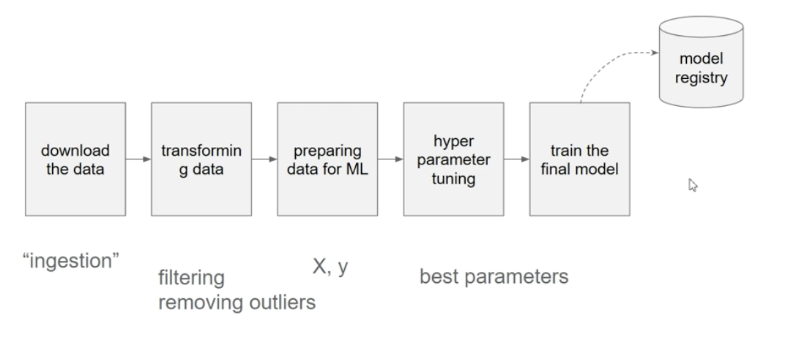

# 03-Orchestration

The orchestration part has been totally updated in 2024

## 3.0.1 ML pipelines
A Machine Learning (ML) pipeline is a structured sequence of processes that are used to automate the workflow involved in building, training, and deploying machine learning models. When we are given a existed notebook, we might want to turn it to a sequence of steps, which is easily to execute and understand.

**Pipeline in Machine learning**

 p.s. feature engineering can be in between transformation and preparing for model

**Tools for Orchestration**:
- Normal Orchestration tools: Airflow, Prefect, Mage

- Machine Learning Orchestration tools: Kubeflow pipeline, MLflow pipelings

## 3.0.2 Running Mage in codespaces

### 1. Mage example BY codespace`###

How to Open a GitHub Codespace in Visual Studio Code:

a.  Fork the repo:
- Fork the Mage to your repository on GitHub.

b. Install the GitHub Codespaces Extension:
- Open Visual Studio Code.
- Go to the Extensions view by clicking on the Extensions icon in the Activity Bar on the side of the window.
- Search for GitHub Codespaces and install the extension.

c. Sign in to GitHub:
- After installing the extension, you might need to sign in to GitHub. Follow the prompts to authenticate your GitHub account with VS Code.

d. Open the Codespace in VS Code:
- Go to the forked `mage-ai` repo, click on `<>code` to create a codespace
- open the codespace in vscode with `TEXT EDITOR` in  `localhost:6789`.

***Note***:

- Create a new gitconfig forder 
- Create a new gitconfig forder `touch .gitconfig` due to the docker-compose.yml file, then start the workspace by `./scripts/start.sh`

### 2. Mage example BY `pip`

- Go to the `mega-ai` repo on vscode through codespace
- Enter `pip install mage-ai` instead of clone the repo
- After installed all dependencies, use `mage start project-name` to open the Mage.

***Note***:

1. `Cannot connect to the Docker daemon at unix:///var/run/docker.sock. Is the docker daemon running?`
ANS: Make sure the docker is running.
2. After typing in browser, the code does not show in local env
ANS: Save the code first.

### 3. Mage example BY Docker-compose ###
1. Check if docker works
There is the 
[Example data pipeline: Quick Start](https://github.com/DataTalksClub/mlops-zoomcamp/blob/main/03-orchestration/3.0/README.md).

### Reference: 
1. AWS EC2: 
* [AWS EC2 Tutorial Beginners to Advance - Full course with Hands On Labs 2023](https://www.youtube.com/watch?v=8SQnGqp3YZM)
    
    About the similar content as what we had in MLops course, but with more explanations.
* [AWS Tutorial on Amazon EC2](https://qyoutube.com/watch?v=8bIW7qlldLg)
    For AWS Certified Solutions Architect Associate Exam Training.

