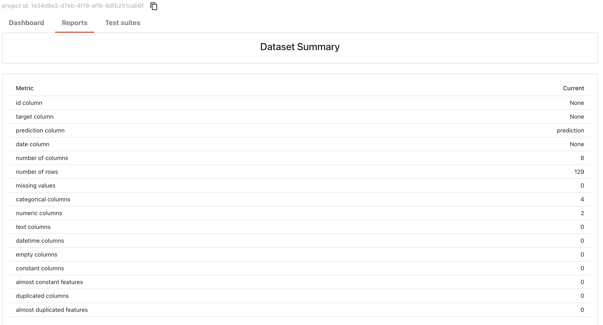
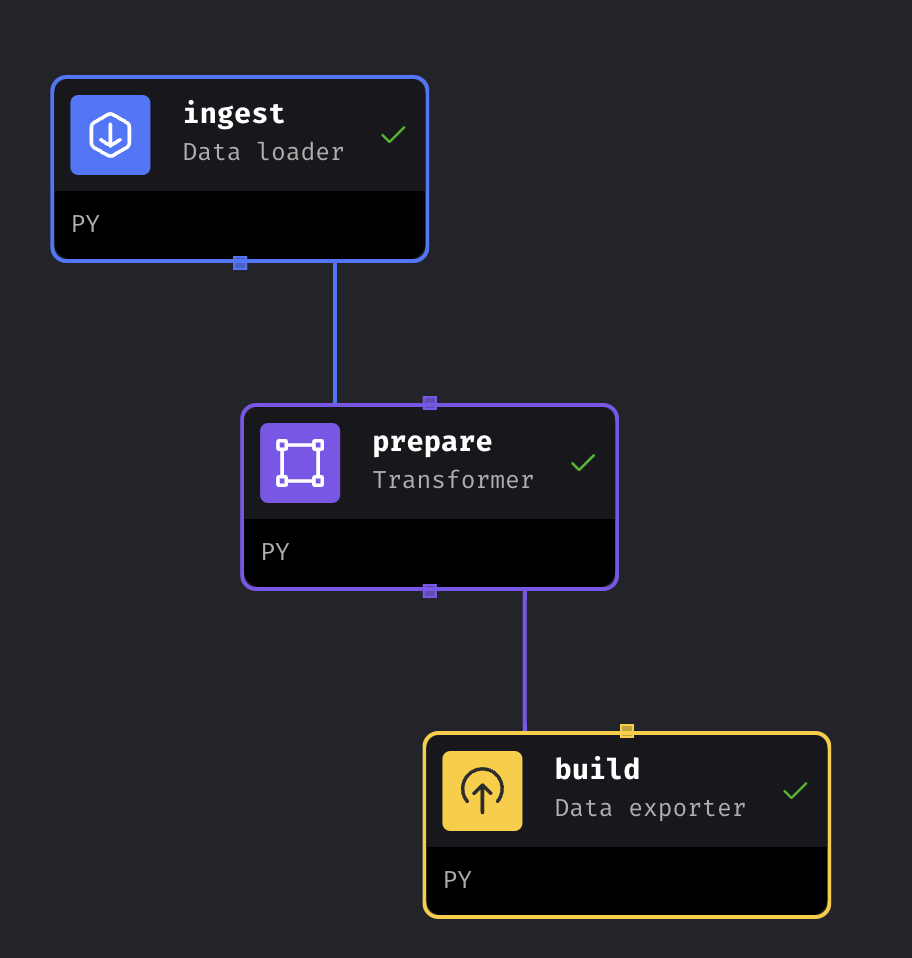
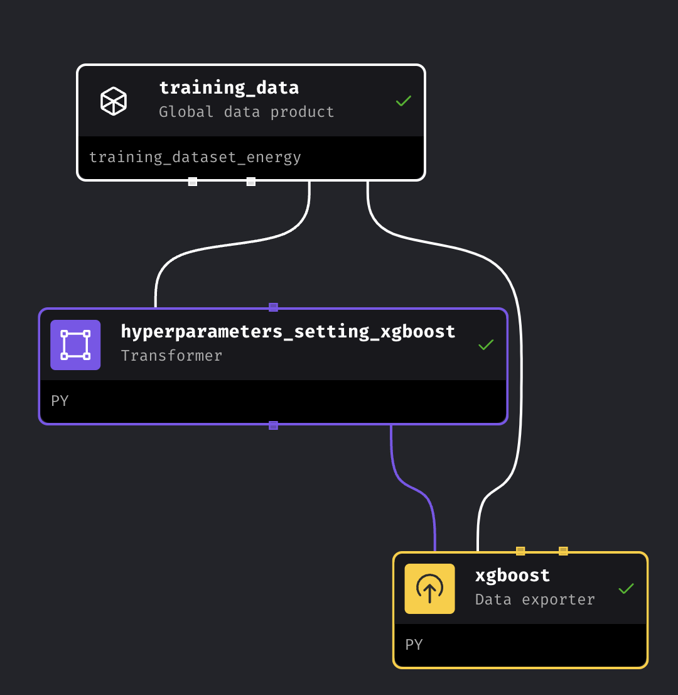

# Energy Consumption Prediction for EV Charging Sessions

## 1. **Project Objective:**
To develop a predictive model for estimating energy consumption during electric vehicle (EV) charging sessions using historical data from a workplace charging program. The model will aid in optimizing energy management, understanding usage patterns, and improving the efficiency of charging infrastructure.

## 2.**Dataset Description:**
The dataset comprises 3,395 high-resolution EV charging sessions, with data collected from 85 EV drivers across 105 stations located at 25 different workplace sites. These sites include various facilities such as research and innovation centers, manufacturing plants, testing facilities, and office headquarters. The dataset is in CSV format, with timestamps recorded to the nearest second, allowing for precise analysis.

## 3. **Key Features:**
- **sessionId:** Unique identifier for each charging session.
- **kwhTotal:** The amount of energy consumed during the session (in kWh).
- **dollars:** The amount of money paid for energy charging.
- **created:** Timestamp for when the charging session started.
- **end:** Timestamp for when the charging session ended.- **dollars:** The amount of money paid for energy charging.
- **startTime:** The min of the created time.
- **endTime:** The min of the end time.
- **chargeTimeHrs:** The total charging mins.
- **weekday:** Indicates if the session occurred on a weekday.
- **platform:** The platform used for accessing the Charging.
- **distance:** The distance from a user's home to the charging location, expressed in miles except where user did not report address..
- **userId:** Unique identifier for each user.
- **stationId:** Unique identifier for each station.
- **locationId:** Unique identifier for each location.
- **managerVehicle:** A ambiguous identifier which is described as "Firm manager vehicle indicator".
- **facilityType:** The type of facility a station is installed at (manufacturing = 1, office = 2, research and development = 3, other = 4). As indicated in the dataset description, all facility types are at workplaces..
- **reportedZip:** A ambiguous identifier for the Zip of the reported location.

<!-- ## 4.**Project Structure:**
1. **Exploratory Data Analysis (EDA):**
   - Conduct EDA to understand the distribution of energy consumption, session durations, and other relevant features.
   - Identify patterns, trends, and correlations within the data.
   
2. **Data Preprocessing for modeling:**
   - Clean and preprocess the data, handling any missing or inconsistent values.
   - Feature engineering to create additional relevant features such as `station_location` identifier.
   - Normalize and transform data as needed for model input.

3. **Model Development:**
   - Split the data into training and testing sets.
   - Develop predictive models using machine learning algorithms such as Linear Regression, Random Forest, or Gradient Boosting.
   - Fine-tune model parameters using cross-validation techniques to optimize performance.

4. **Model Evaluation:**
   - Evaluate the models using metrics such as Root Mean Squared Error (RMSE), and R-squared.
   - Select the best-performing model for deployment.

5. **Model Deployment:**
   - Deploy the predictive model, dataset, service on AWS S3, EC2 Instance, RDS.
   - Dockerized the online web service.
   - Set up a monitoring system to track model performance and retrain it with Evidently AI, Grafana and PostgreSQL.

This project will contribute to the ongoing efforts in optimizing EV charging infrastructure and support sustainable energy management practices in workplace environments. -->


## 4. **How to Use**: 
### **4.1 Environment preparetion**

### Using conda
1. Clone the repository: `https://github.com/Muhongfan/MLops-zoomcamp-2024.git`

2. Navigate to Project directory: `cd project`

3. Create and activate the conda environment using the `environment.yml` file:

```
conda env create -f environment.yml
conda activate mlopsproject
```
or
### Using Pip
1. Clone the repository: `https://github.com/Muhongfan/MLops-zoomcamp-2024.git`

2. Navigate to Project directory: `cd project`

3. Install the required packages using `requirements.txt`:`pip install -r requirements.txt`
### **4.2 Model training, tracking and registry**
* Go to `mlops` and run `./scripts/start.sh` to set up the orchestration with mageai. 
* Go to `http://localhost:6789/` to open the mageai on your browser
* Go to `project_energy_consumption->Pipelines` to run each pipelines. (`data preparetion -> xgboost_training -> model_registry`) 

***Note:***
As the modle and artifacts are deployed on AWS, In `model_registry`, it requires your AWS profile info.

### **4.3 Model training, tracking and registry**

All details are in [the web service for energy consumption prediction project](project/service/web-service-mlflow-with-Docker)

Check the registryed model on terminal with `TRACKING_SERVER_HOST:5000`, where `TRACKING_SERVER_HOST` is the DNS of your EC2 instance (MLflow sever).

### **4.4 Containerized Infrastructure with Docker**
Docker was used to build a container-based infrastructure, which packaged the entire environment into containers, making it portable and consistent across different machines.

#### Docker build up

1. Under the folder [service](service/web-service-mlflow-with-Docker). The tree of the folder is 
```
├── aws_utils
├── data
├── mlops
├── service
    ├── web-service-mlflow-with-Docker
    │   ├── Dockerfile
    │   ├── Pipfile
    │   ├── Pipfile.lock
    │   ├── downloads
    │   │   └── models
    │   │       ├── MLmodel
    │   │       ├── conda.yaml
    │   │       ├── model.pkl
    │   │       ├── python_env.yaml
    │   │       └── requirements.txt
    │   ├── predict.py
    │   └── test.py
    └── monitoring

```
* `aws_utils`: upload config file and dataset that are used for workflow with mageai; 
* `data`: dataset
* `mlops`: workflow with mageai
* `service`: webservice and monitoring service

2. Setup your AWS profile

3. Build the docker with `docker build -t energy-consumption-prediction-service-mlflow:v1 .` for webservice under `service/web-service-mlflow-with-Docker` 

3. Run the docker
<!-- 
`docker run -v ~/.aws:/root/.aws:ro -p 9696:9696 energy-consumption-prediction-service-mlflow:v1` -->

    ```
    docker run -e RUN_ID=your_run_id -e EXP_ID=your_exp_id -e AWS_PROFILE=your_aws_profile -v ~/.aws:/root/.aws:ro -p 9696:9696 your-image-name
    ```
    with which requires the configure of your run_id, experiment_id and AWS profile

**Note:**
- The run_id, experiment_id can be obtained from step 4.2 on Mage-ai, Model_registry process.
- AWS profile is expected to be your own AWS profile.
- Run the test file via `python test.py`


**Note**:

* `docker logs -f` to show the realtime logs .


## Orchestration
Using mage AI for ML workflow.


### Setup
1. Jump to folder `mlops/` and start the service with `./scripts/start.sh`

2. Open `http://localhost:6789` in your browser.

### Monitoring results (some)



## . The Projects Structures
1. **EDA and Data preprocessing**
The primary goal of the first step is to gain a basic understanding of the dataset related to energy consumption during electric vehicle (EV) charging sessions. Additionally, the analysis will explore and identify relationships between key variables such as energy consumption, associated costs, distance traveled, charge time, and user behavior.

All details are in [EDA for energy consumption dataset](project/EVs.ipynb)

2. **Modelling and tracking**
The next step involves building the modeling process based on the exploration and setting up an experiment tracking pipeline using MLflow. The entire service will be deployed on AWS, utilizing EC2 for the tracking server, RDS for metadata storage, and an S3 bucket for storing datasets and models. Deployment will be managed using Docker to ensure consistency and scalability across the environment. This setup will streamline model experimentation and tracking, enhancing the efficiency of the development workflow.

All details are in [this jupyter notebook](project/energy_forecast.ipynb)

3. **orchestration**
- Data preparatio
 
- Model training

- Model registry
 

All details are in [mlops folder](project/mlops)

4. **Deployment**
The deployment is with MLflow and on AWS.

All details are in [the web service for energy consumption prediction project](project/service/web-service-mlflow-with-Docker)
